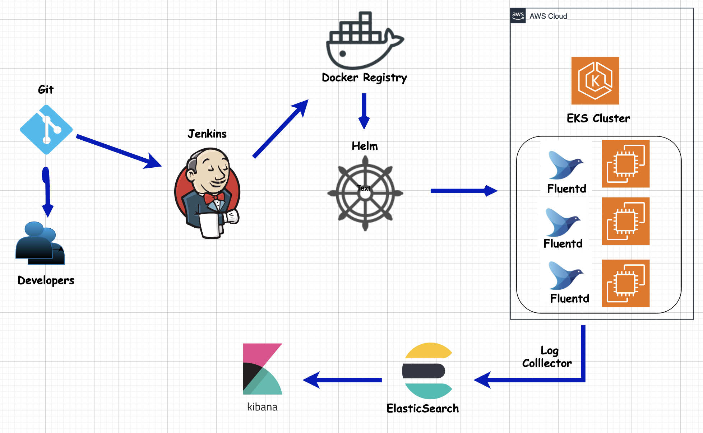

## Build and Deploy Java SpringBoot Application

## Getting Started

To get started with this project, follow these steps:

1. Clone this repository to your local machine.
2. Refer to the architecture diagram to understand the flow and interaction of components.

